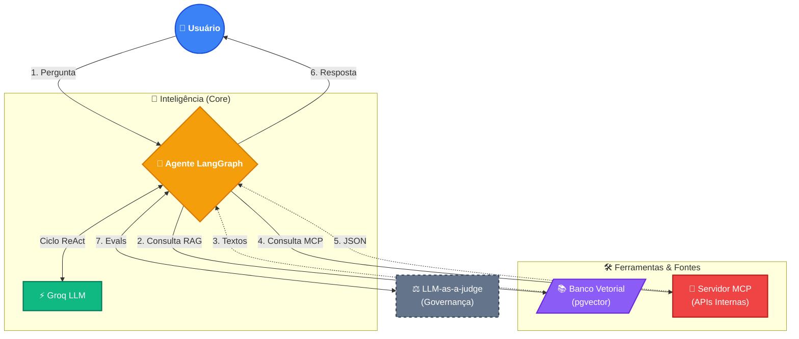

# AgentForge MCP 🤖🚀

[](https://www.python.org/downloads/)
[](https://python.langchain.com/docs/langgraph)
[](https://groq.com/)
[](https://modelcontextprotocol.io/)
[](https://github.com/pgvector/pgvector)

Plataforma de orquestração de **Agentes Autônomos** com **RAG Avançado** (Retrieval-Augmented Generation), construída utilizando o **Model Context Protocol (MCP)** e **LangGraph**. Este projeto foi desenvolvido para demonstrar arquitetura moderna de IA, fluxos agênticos cíclicos e alta performance no consumo de ferramentas corporativas.

## 🌟 Destaques da Arquitetura

Este repositório consolida as melhores práticas e frameworks exigidos por times de ponta em Engenharia de IA:

- **Esteiras Agênticas:** Utiliza o `LangGraph` (`create_react_agent`) para fluxos de raciocínio cíclicos (ReAct), garantindo que o agente só responda após consultar as fontes de verdade.
- **RAG Local e Eficiente:** Embeddings gerados de forma local (e gratuita) usando `HuggingFace (all-MiniLM-L6-v2)`, com armazenamento e busca de similaridade efetuados no **PostgreSQL + pgvector** rodando via Docker.
- **Model Context Protocol (MCP):** Implementação de um servidor MCP nativo expondo "Tools", permitindo padronização na forma que as IAs interagem com ferramentas corporativas (simulado com FastAPI/Stdio).
- **LLM-as-a-judge (Evals):** Pipeline de observabilidade onde respostas geradas pelo agente são avaliadas sistematicamente por outro LLM, garantindo que políticas corporativas sejam respeitadas.
- **Incrível Performance:** O raciocínio do Agente é alimentado pela API do **Groq**, oferecendo latências absurdamente baixas na inferência.

## 🏗️ Diagrama de Arquitetura



## 🚀 Como Executar Localmente

### 1. Requisitos
- [Python 3.10+](https://www.python.org/)
- [Docker Desktop](https://www.docker.com/products/docker-desktop)
- Chave de API do [Groq](https://console.groq.com/)

### 2. Configuração do Ambiente

Clone o repositório e crie o ambiente virtual:
```bash
git clone https://github.com/seu-usuario/agentforge-mcp.git
cd agentforge-mcp
python -m venv .venv
# Ativar no Windows:
.venv\Scripts\Activate
# Ativar no Linux/Mac:
source .venv/bin/activate

pip install -r requirements.txt
```

Crie um arquivo `.env` na raiz do projeto com o seguinte conteúdo:
```env
POSTGRES_USER=admin
POSTGRES_PASSWORD=admin123
POSTGRES_DB=agentforge
POSTGRES_HOST=localhost
POSTGRES_PORT=5432
GROQ_API_KEY=sua-chave-api-aqui
```

### 3. Subindo o Banco Vetorial (pgvector)
```bash
docker-compose up -d
```
*Opcional: Teste a conexão rodando `python rag_pipeline/database.py`.*

### 4. Ingestão de Documentos (RAG)
Quebra o conhecimento corporativo em vetores e os envia para o PostgreSQL.
```bash
python rag_pipeline/ingest.py
```

### 5. Rodando o Agente
Interaja com o agente base, que utilizará a base vetorial e suas ferramentas para deduzir respostas baseadas em regras de negócio:
```bash
python agents/auditor.py
```

### 6. Executando Evals (LLM-as-a-judge)
Para garantir a qualidade e testar a mitigação de alucinações da IA:
```bash
python evals/test_rag.py
```

## 🧪 Servidor MCP Independente
Você pode levantar as ferramentas isoladas num servidor Model Context Protocol via Stdio para debugar com o MCP Inspector:
```bash
npx -y @modelcontextprotocol/inspector python mcp_server/server.py
```

---
Feito com 💡 foco em orquestração avançada de IA. 
